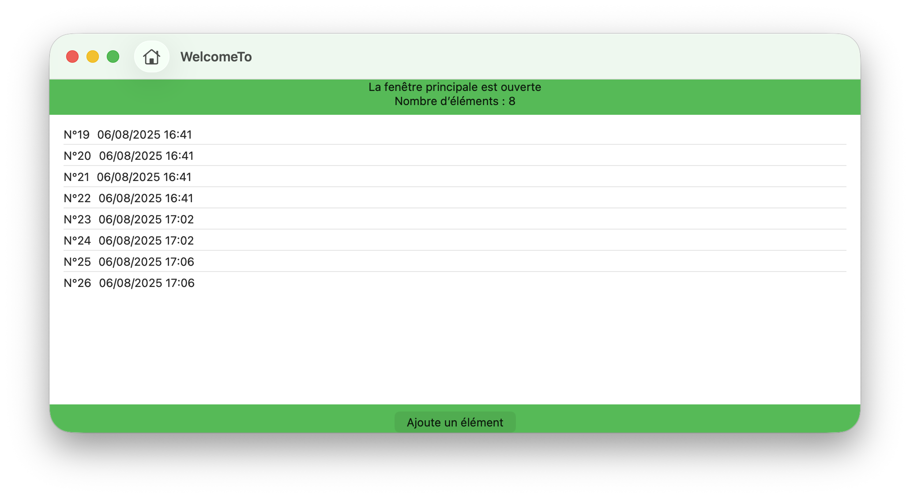

The macOS application “WelcomeTo” offers a modern interface for project/document management, with data persistence thanks to SwiftData. It is structured around two main windows:

<em>Doc1</em>

<em>Doc2</em>

1. Welcome Screen (WelcomeWindowView)
• Presents a welcome screen to the user with:
• The name and version of the application.
• A list of recent projects (displayed on the right).
• Three main actions:
  • Create a new document (resets the database).

  • Open an existing document (via a macOS dialog).

  • Open a sample project.

• Uses an HStack design with visual separation.

2. Main Project Screen (ContentView)
• Displays the list of items stored in the database.
• Shows the total number of items.
• Allows quick addition of a new item (with date/time).
• Focuses the main window when displayed.

3. Data Management
• Uses SwiftData to persist items in a dedicated folder within the Documents directory (WelcomeBDD/WelcomeTo.store).
• CRUD operations are performed via modelContext.

4. Application Structure
• The main entry point is WelcomeToApp.
• An AppState (ObservableObject) state object is used to handle navigation (welcome or main screen), and to store the active database URL.

5. User Experience
• Welcome management with splash animation (SplashManager).
• Explicit activation of the main window to enhance the macOS user experience.
• Support for undo operations (UndoManager).

⸻

In summary:
This is a macOS “project/document manager” application with a welcome screen, simple navigation, local data persistence, and a user experience tailored to the Apple ecosystem.
