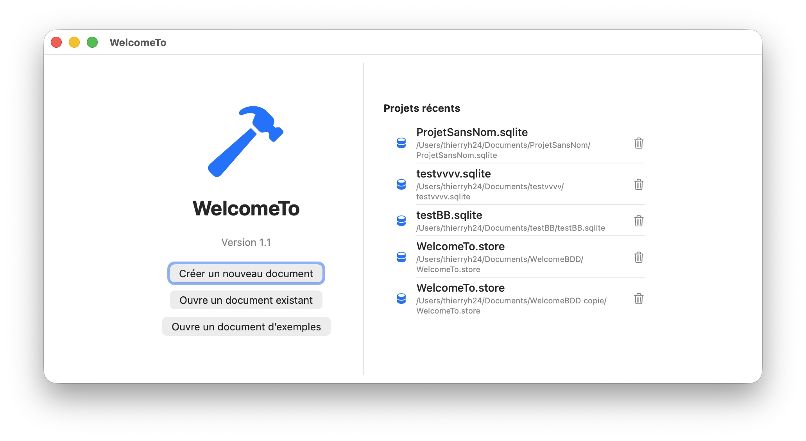

  
    

L'application macOS « WelcomeTo » offre une interface moderne pour la gestion de projets et de documents, avec la persistance des données grâce à SwiftData. Elle s'articule autour de deux fenêtres principales :

<a href="README.md">English</a> | <a href="README_fr.md">Français</a>

<em>Doc1</em>

<em>Doc2</em>

1. Gestion de l’état global
• La classe AppState (ObservableObject) gère l’état global de l’app :
   • databaseURL : l’URL de la base de données en cours
   • isProjectOpen : indique si un projet est ouvert

2. Cycle de vie de l’application
• WelcomeToApp est le point d’entrée principal (@main).
• Elle crée et conserve :
   • Un AppState partagé (pour l’état)
   • Un gestionnaire de projets récents (RecentProjectsManager)
   • Un contrôleur de données (DataController), qui encapsule le conteneur SwiftData

3. Initialisation et gestion de la base de données
• Au démarrage, un dossier spécifique (“WelcomeBDD”) est créé dans le dossier Documents de l’utilisateur pour stocker la base.
• Le conteneur de modèles SwiftData (ModelContainer) est initialisé avec ce chemin.
• L’application gère les undo via un UndoManager.

4. Navigation et affichage
• Si un projet est ouvert (isProjectOpen), l’app affiche ContentView avec le contexte de données.
• Sinon, elle présente une vue de bienvenue (WelcomeWindowView) pour ouvrir ou créer un projet, affichant aussi les projets récents.

5. Architecture
• Utilisation de l’environnement SwiftUI pour partager le contexte de données (.environment(\.modelContext, …)) et l’état global (.environmentObject(appState)).
• Il existe une classe dédiée DataController pour encapsuler la configuration du modèle SwiftData.

⸻

En résumé

L'application permet :
• De gérer des projets stockés localement (avec SwiftData)
• D’ouvrir/créer des projets, de lister les projets récents
• De passer d’un écran d’accueil à un écran principal selon l’état d’ouverture d’un projet

L’architecture suit les bonnes pratiques SwiftUI avec une séparation claire entre l’état, la gestion des données et l’interface utilisateur.

autre readMe

# WelcomeTo

Bienvenue sur le projet **WelcomeTo** !

## Présentation

WelcomeTo est un projet développé principalement pour Mac en Swift. Il fait partie de mes projets favoris, aux côtés de [PegaseUIData](https://github.com/thierryH91200/PegaseUIData).

Ce projet vise à proposer une expérience utilisateur fluide, moderne et adaptée à l’écosystème Apple. Que vous soyez développeur, utilisateur final ou simplement curieux, WelcomeTo vous invite à découvrir ses fonctionnalités et son code source.

## Points clés du projet

- **Développement Swift** : conçu nativement pour macOS.
- **Expérience utilisateur** : interface claire et agréable.
- **Projet personnel** : développé dans le cadre de ma retraite, pour explorer et approfondir le développement sur Mac.
- **Favori** : WelcomeTo est un projet auquel je consacre une attention particulière.

## Activités connexes

En dehors du développement, je pratique la marche et le vélo – des activités qui inspirent parfois les fonctionnalités ou le design du projet.

## Autres projets

- [PegaseUIData](https://github.com/thierryH91200/PegaseUIData)

## Contact

Pour toute question ou suggestion : [thierryH91200 sur GitHub](https://github.com/thierryH91200)

---

Merci d’utiliser ou de contribuer à WelcomeTo !
